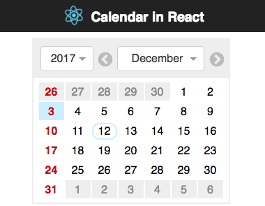

# calendar-in-react

A simple implementation of a calendar in React

This is a small programming exercise to display a calendar panel with year and
month selectors and support for parsing and updating of the URL. I added an
option to select individual days because it seemed logical.

## Structure

The basic layout is generated by create-react-app. The main App.render() method
sets up the header and a React BrowserRouter instance with a single route for
the calendar component.

The calendar in this case is a higher-order component (HOC) wrapper around a
simple component that does the actual rendering. The HOC includes all the
features related to URL parsing and manipulation of the browser history. The
plain component can be used anywhere a calendar is required, the HOC only makes
sense as child component of a Route.

Additionally I implemented a callback function that get's called when a new date
is selected. This can be used to pass the new date to other parts of the
application, for example a global store. With the callback the calendar
component itself does not require any form of global data management and can
rely only on it's internal state for the display.

### The Calendar Component

The calendar itself is split in the header with dropdown input elements to pick
the year and month and the panel to display the days of the selected month.

With the exception of the select elements all parts of the calendar are static
and only implement a `render()` function to return the new ESX markup. They
could just as well be implemented as functional components but there seems to be
a disagreement whether that actually improves performance. The calendar itself
implements a `shouldComponentUpdate()` method to avoid unnecessary redraws.

### Day Component

The display of individual days is controlled by the `CalendarDay` component.
It compares the current date and current selection against each day and adds
corresponding classes to a div element. The current day gets a blue background,
the selected day is outlined, days outside the selected month have a grey
background and sundays are bold red. All this is defind in the CSS file.  

### Header Component

In the header I have combined two
[react-select](https://github.com/JedWatson/react-select) Select components and
SVG icons for the next and previous buttons. The header also contains the logic
to build a new date from the updated selection and pass it back to the parent
(the calendar).

### Arrow Button

The arrow button component is a bit special because it includes the SVG `path`
data for both arrows as ESX. The component returns the complete ESX markup for
the SVG arrow icon, depending on the orientation('previous' or 'next'). This
avoids additional HTTP requests to load the small SVG files and the color of
the arrows can be defined via CSS.

## File Layout

I like to keep all the files related to a component in on directory. This
includes the types, actions and reducers needed for Redux (not used in this
example). Everthing that is needed by a higher level of the application is
re-exported in the `index.js` file.

In a larger application I could then import the reducer in one file to
create the store and a connected component in another file to build the
interface. Once the component has stabilized it can be packaged as
self-contained npm package and removed from the active source tree.
